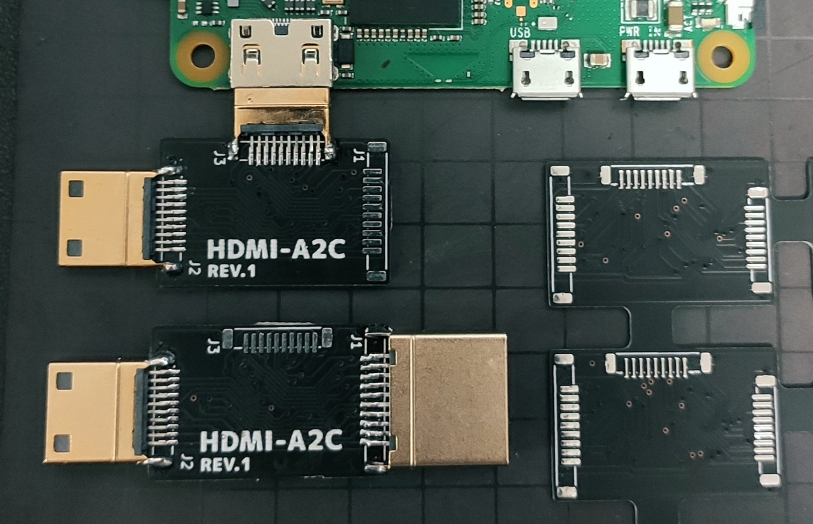
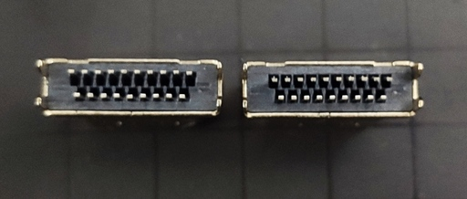
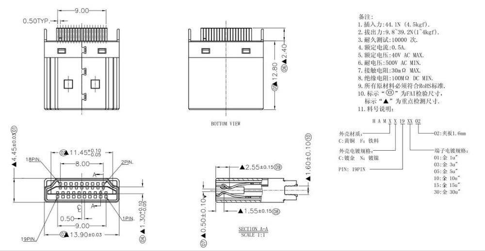
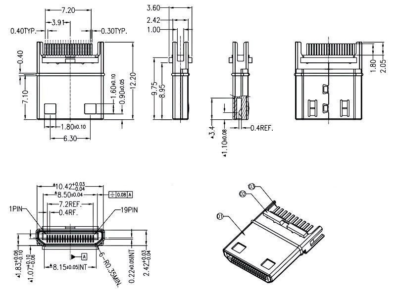
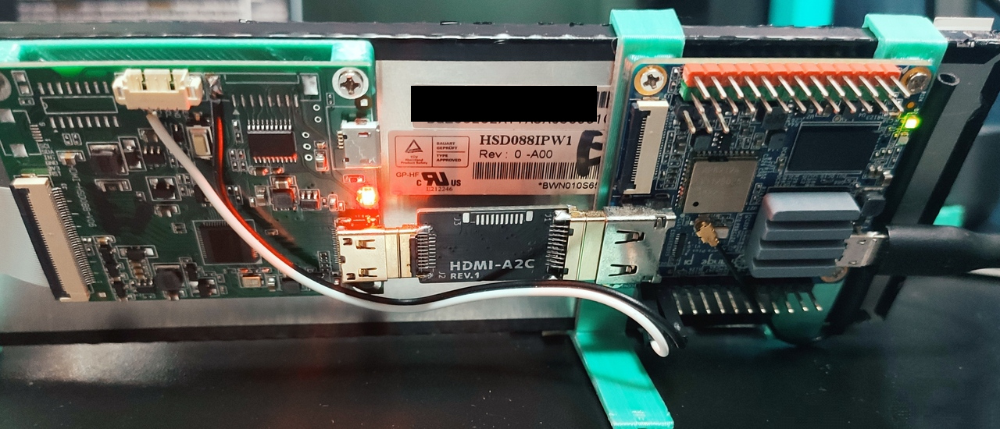

# HDMI-A2C
A simple `HDMI Type A Male` to `mini HDMI (aka HDMI Type C) Male` adapter board.

  

## BOM
| Name                         | Quantity | Typ. price (USD) | Notes                                    |
| ---------------------------- | :------: | ---------------- | ---------------------------------------- |
| HDMI (Type A) Male Plug      |    1     | 0.2 ~ 0.9        | [See below](#hdmi-type-a-male-plug)      |
| mini HDMI (Type C) Male Plug |    1     | 0.3 ~ 1.8        | [See below](#mini-hdmi-type-c-male-plug) |

#### `HDMI (Type A) Male Plug`
- Notes
  - Before soldering, pins on the upper side must be bended slightly, to make the parts "grab" the board of 1 mm thickness. (It expects 1.6 mm of board thickness, however the mini HDMI plug requires 1 mm.)
  
- Data sheets
  -  ([src](https://www.aliexpress.com/item/32963116074.html))
- Sellers
  - Note that the following parts are not the same model exactly, however they are pin-compatible AFAIK.
  - [aitendo HDP19-017](https://www.aitendo.com/product/19008)
  - [Aliexpress 10PCS HDMI Male Jack/plug connector 19PIN 19P 1.6MM 180 Degree Gold-Plated hd 19 PIN](https://www.aliexpress.com/item/32963116074.html)

#### `mini HDMI (Type C) Male Plug`
- Data sheets
  -  ([src](https://www.aliexpress.com/item/32653409668.html))
  - [MH-02PLG.pdf](http://aitendo3.sakura.ne.jp/aitendo_data/product_img/cn/hdmi/MH-02PLG/MH-02PLG.pdf)
- Sellers
  - Note that the following parts are not the same model exactly, however they are pin-compatible AFAIK.
  - [aitendo MH-02PLG](https://www.aitendo.com/product/19500)
  - [Aliexpress cltgxdd Gold plating 19 PiN male plug C Type HDMI Jack Splint Type,HDMI repair replacement](https://www.aliexpress.com/item/32863394130.html)

## PCB
- Required specs
  - **PCB Thickness: 1mm**
    - This is required for the mini HDMI plug.
  - Layers: 2
  - PCB & Silkscreen color: Black and white, but choose anything you like.
- Gerber
  - See zip files under [./gerber](./gerber).
  - [`hdmi_a2c_rev1_panelized_3x4.zip`](./gerber/hdmi_a2c_rev1_panelized_3x4.zip) is a panelized one.
    - Credit: It was made with [This is Not Rocket Science]'s Gerber Panelizer.
  - Or just use KiCad v5 to generate files.
- For reference, I ordered the REV.1 board from JLCPCB in this time.

## Changelog
- REV.1
  - Initial release
  - Known issues:
    - `HDMI_A_HDP19-017_Horizontal.kicad_mod`: Though it's solderble, its pad pitch is a little narrower than the actual (0.5 mm).

## License
MIT

## Related projects
- ~~LandscaPi~~ TBD
